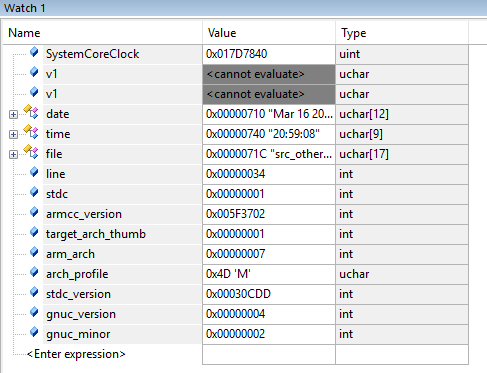
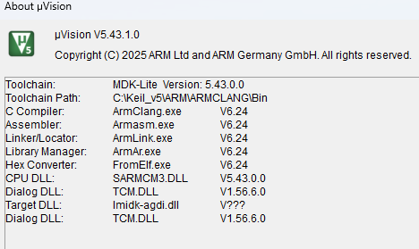

# Relatório do Laboratório 1 de ELEW32

## Primeira Tarefa

> Altere o projeto exemplo para incluir atribuir o valor destes símbolos pré-definidos (predefined preprocessor symbols): `__cplusplus` `__DATE__` `__TIME__` `__FILE__` `__LINE__` `__STDC__` `__ARMCC_VERSION` `__TARGET_ARCH_THUMB` `__ARM_ARCH` `__ARM_ARCH_PROFILE` `__STDC_VERSION__` `__GNUC__` `__GNUC_MINOR__` à variáveis globais.

A principio, tinha-se criado apenas:
```c
int line = __LINE__;
```

Mas isso faz com que o compilador ignore essas variaveis globais, pois essas não estão sendo utilizadas no código principal. Para forçar o uso delas, foi descoberto o atributo de variável chamado *\_\_attribute\_\_((used))*, que, de acordo com a documentação : *This variable attribute informs the compiler that a static variable is to be retained in the object file, even if it is unreferenced.*

🔗 [Documentação](https://developer.arm.com/documentation/dui0491/i/Compiler-specific-Features/--attribute----used---variable-attribute?lang=en)

Considerando esses pontos, feitas as seguintes mudanças no código:

```c
/*------------------------------------------------------------------------------
 *
 * Global vars
 *
 *------------------------------------------------------------------------------*/
volatile uint32_t msTicks;                      /* counts 1ms timeTicks       */
//volatile const char a = __cpluspluc;          Não funcionou, acredito por ser C e não C++.
__attribute__((used)) const char date[] = __DATE__;
__attribute__((used)) const char time[] = __TIME__;
__attribute__((used)) const char file[] = __FILE__;
__attribute__((used)) int line = __LINE__;
__attribute__((used)) int stdc = __STDC__;
__attribute__((used)) int armcc_version = __ARMCC_VERSION;
__attribute__((used)) int target_arch_thumb = __thumb__;
__attribute__((used)) int arm_arch = __ARM_ARCH;
__attribute__((used)) char arch_profile = __ARM_ARCH_PROFILE;
__attribute__((used)) int stdc_version = __STDC_VERSION__;
__attribute__((used)) int gnuc_version = __GNUC__;
__attribute__((used)) int gnuc_minor = __GNUC_MINOR__;
```

> Examine os valores atribuídos e interprete-os.

Para analisar seus valores, foi feito os seguintes passos: *View -> watch windows -> watch 1*.



Podemos perceber os seguintes valores para as varíaveis:

* **\_\_Date\_\_** = `0x00000710` "Mar 16 2026", informa o dia atual, no formato MM/DD/AAAA;
* **\_\_TIME\_\_** = `0x00000740` "20:59:08", Informa o horario atual, no formato HH:MM:SS;
* **\_\_FILE\_\_** = `0x0000071C` "src_other/main.c", Informa o caminho do arquivo atual;
* **\_\_LINE\_\_** = `0x00000034`, Informa a linha atual em Hexadecimal;
* **\_\_STDC\_\_** = `0x00000001`, Informa que o código esta sobre os conformes das normas do C (Standard C);
* **\_\_ARMCC_VERSION** = `0x005F3702`. Na documentação diz que deve ser interpretado como decimal, portanto 6240002. Na documentação diz seguir a seguinte ordem:**Mmmuuxx**, sendo **M** a maior versão, **mm** a versão menor, **uu** o número da atualização e xx uso reservado para o ARM. Portando temos v6.24, sem atualizações extras;

A imagem a seguir comprova a veracidade da resposta:



* **\_\_thumb\_\_** = `0x00000001`, Informa que o compilador gera o código para conjunto de instruções *THUMB*;
* **\_\_ARM_ARCH** = `0x00000007`, Especifica a versão da arquitetura alvo, ou seja, ARM7;
* **\_\_ARM_ARCH_PROFILE** = `0x4D` 'M', Especifica o perfil da arquitetura alvo;
* **\_\_STDC_VERSION\_\_** = `0x00030CDD`, em decimal, 199901, Informa a versão padrão em AAAAMM, portanto, 01/1999;
* **\_\_GNUC\_\_** = `0x00000004`, Indica a versão maior do GNU sendo usado;
* **\_\_GNUC_MINOR\_\_** = `0x00000002`, indica a versão menor no GNU sendo usado;
* **\_\_cpluspluc** = Não foi encontrado, acredita-se pelo fato do código ser compilado em C, e não C++.

---

## Questões a serem respondidas

### IDE:

**- quais os comandos referentes a controle da execução (passo-a-passo, step-over, step-out, breakpoints,...) ?**

* **Step :** Entra dentro da função na linha atual.
* **Step Over:** Executa a linha atual sem entrar em funções chamadas.
* **Step Out:** Executa o restante da função atual e volta para quem a chamou.
* **Run:** Executa o código continuamente até encontrar um breakpoint.
* **Stop:** Pausa a execução.
* **Breakpoints:** Clicar na margem cinza, a esquerda, da linha de código para ativar/desativar. Para gerenciar todos, vá em Debug -> Breakpoints.

**como visualizar registradores da CPU ?**

Para achar os registradores, deve iniciar o modo debug, e ir em *View -> Register windown*. Nessa janela podemos encontrar: R0-R15, xPSR, MSP, PSP.

**como visualizar registradores de periféricos integrados ?**

Para achar os Periféricos, deve iniciar o modo debug, e ir em *Peripherals -> System Viewer*. Nessa janela podemos encontraros periféricos do chip  como o GPIOA, USART1, ADC.

**como visualizar/modificar endereços específicos de memória?**

Para visualizar os endereços específicos de memória, devemos iniciar o modo debug, e ir em *View-> Memory Windows -> Memory 1*. Nessa janela podemos digitar no campo o endereço desejado tipo `0x20000000` para memória RAM e ao clicar na celúla da memória podemos digitar um novo valor desejado.

**como visualizar o valor de variáveis ou expressões?**

Para visualizar o valor de variáveis ou expressões, podemos ir em *view->Watch Windows -> Watch 1* e ao digitar a varíavel ou expressão como `msTicks` podemos ver o valor atualizado em tempo real durante o debug.

**porque nem todas as variáveis podem ter seu valor visualizado?**

Diversas razões entre a otimização do compilador(ignorando variáveis não usadas, manter variáveis temporárias) fazendo ela nao existir mais em memória. Outras razões possíveis podem ser as variáveis estarem fora do escopo(local a uma função) ou também  variável declarada mas nunca usada.

**qual o papel dos comandos de:**

* **Options for target:** Faz a configuração de toda a compilação e hardware do projeto.
* **Manage Run-Time Environment:** Permite selecionar os componentes de software que vão ser usados no projeto.
* **PackInstaller:** Gerencia os DFP (Device Family Pack) que tem os drivers, headers entre outros.

**o que acontece se retirar o elemento CMSIS (verde) dos itens do projeto?**

Se retirarmos o elemento CMSIS(verde) do projeto que tem as definições do cortex-m, arquvios de inicialização, acesso padronizado aos registradores, drivers básicos e configurações de interrupções diversos problemas podem acontecer entre: o projeto não compilar, arquivos importante sumirem, sistema nao iniciar corretamente e acessos ao registradores quebrarem.

---


### Referências
* 🔗 [documentação ARM compilador 6](https://developer.arm.com/documentation/101754/0624/armclang-Reference/Other-Compiler-specific-Features/Predefined-macros)
* 🔗 [documentação ARM compilador 5](https://developer.arm.com/documentation/dui0282/b/arm-compiler-reference/predefined-macros)
* 🔗 [Documentação \_\_atribute(used)\_\_](https://developer.arm.com/documentation/dui0491/i/Compiler-specific-Features/--attribute----used---variable-attribute?lang=en)