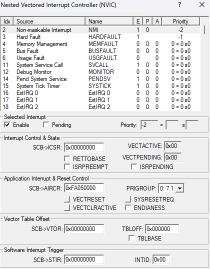

# Relatório do Lab 2

NOMES:  
João Lucas Marques Camilo

Bruno Ribeiro Basilio
    
---

## 1. Introdução

Este relatório descreve a interação com a placa Tiva TM4C1294XL utilizando a biblioteca TivaWare. O objetivo é desenvolver uma aplicação embarcada que utilize interrupções, LEDs e botões para medir o tempo de reação do usuário.

## 2. Planejamento do processo de desenvolvimento
* Estudo detalhado do hardware (Placa Tiva) e do software (TivaWare).
* Análise de exemplos de códigos de GPIO (controle de LEDs) e de interrupções acionadas por botões.
* Configuração do ambiente de desenvolvimento no Keil uVision v5.
* Implementação do código baseando-se nos exemplos encontrados e na arquitetura de interrupções.
* Testes, depuração e sincronização com o repositório GitHub.

## 3. Definição do problema a ser resolvido
O objetivo da aplicação a ser desenvolvida é medir o tempo de reação do usuário. Isto será feito acendendo um LED e medindo o tempo decorrido até o usuário pressionar um botão. O problema pode ser entendido como um jogo em que o objetivo é responder no menor tempo possível.

## 4. Especificação da solução
**Requisitos Funcionais**
* **RF1:** O jogo deve ligar o LED D1 para informar ao jogador o início da contagem de tempo.
    * **RF1.1:** O LED deve ser aceso até 1 segundo após o início da operação da placa.
* **RF2:** O jogo usa o botão SW1 para entrada de dados pelo usuário.
* **RF3:** O jogo deve apresentar a contagem de tempo no Terminal Serial indicando o número de clocks e o tempo correspondente em ms.

**Requisitos e Restrições Não Funcionais**
* **RNF 1:** O limite superior de contagem de tempo é o equivalente a 3 segundos.
* **RNF 2:** Usar o SysTick como temporizador.
* **RNF 3:** Usar funções da TivaWare para acesso a I/O, SysTick e temporização.
* **RNF 4:** A solução deve fazer uso de interrupções, obrigatoriamente de GPIO e opcionalmente do SysTick.
* **RNF 5:** O vetor de exceções deve estar em memória Flash e não na RAM.

## 5. Estudo da plataforma de HW
* **Cristal Externo:** A placa Tiva TM4C1294XL utiliza um cristal de 25 MHz.
* **LED D1:** Conectado ao pino PN1.
* **Botão SW1:** Conectado ao pino PJ0.
* **Temporizador SysTick:** Possui um contador de 24 bits. Portanto, o valor máximo que pode ser carregado no registrador de recarga é 2^24 - 1, resultando em 16.777.215.
    * Considerando a contagem máxima a uma frequência de 120 MHz,  o período foi definido como clock / 1000 = 1 ms

## 6. Estudo da plataforma de SW
**6.1 Prefixo `MAP_`**
Fornece um mapeamento automático para acessar funções já implementadas nativamente na ROM do dispositivo. Isso otimiza o código, pois muitas das funções não precisam ser compiladas na Flash, bastando procurá-las e chamá-las através deste prefixo.

**6.2 Passos para resolver incompatibilidade de versão do compilador**
Para compilar corretamente o projeto no Keil, os seguintes passos foram executados:
* Modificar o arquivo `startup_TM4C129.s` (linha 304) para o novo padrão `#if`, `#def`, `#else`.
* Acessar *Project -> Manage -> Migrate to Version 5*.
* Selecionar a placa *TM4C1294NCPDT* para compilar o projeto.
* Remover a flag `-c99` em *misc-controls*.

**6.3 Funções da TivaWare Utilizadas**
* `SysCtlClockFreqSet()`: Configura a frequência do clock.
* `SysCtlPeripheralEnable()` / `SysCtlPeripheralReady()`: Habilita e aguarda a prontidão dos periféricos.
* `GPIOPinTypeGPIOOutput()` / `GPIOPinTypeGPIOInput()`: Estabelece a direção dos pinos.
* `GPIOPadConfigSet()`: Configura o resistor pull-up para o funcionamento correto dos botões.
* `GPIOIntTypeSet()`: Define o *Trigger* da interrupção.
* `GPIOIntEnable()` / `IntEnable()`: Habilita a interrupção no pino específico e no controlador NVIC.
* `GPIOIntStatus()` / `GPIOIntClear()`: Identifica qual pino gerou o evento e limpa a respectiva *flag* de interrupção.
* `SysTickPeriodSet()`: Define o valor de recarga do contador SysTick.
* `SysTickIntEnable()`: Habilita a interrupção gerada pelo estouro do contador SysTick.
* `IntMasterEnable()`: Habilita o processamento global de interrupções pelo processador.

**6.4 Garantia da Memória Flash**

Nenhuma função que faça a realocação vetorial para a RAM foi utilizada. Além disso, a verificação no depurador confirmou que o registrador VTOR permanece apontando para a posição `0x00000000` durante a execução, assegurando que o vetor de exceções está operando na memória Flash.

## 7. Projeto (design) da solução
A solução do laboratório começa com a inicialização de periféricos, após isso, um looping verificando o limite máximo de tempo determinado, no caso 3 segundos.De forma concorrente, o sistema utiliza o SysTick para incrementar autonomamente uma base temporal a cada 1 ms, e uma interrupção assíncrona de GPIO (borda de descida no botão SW1) para calcular e reportar o tempo de reação final via comunicação serial. O diagrama de atividades (UML) abaixo ilustra o comportamento do software:

TODO 

## 8. Configuração do projeto na IDE (Keil uVision)
O Target do Keil foi configurado selecionando o microcontrolador **TM4C1294NCPDT**. Foi incluso os arquivos  **BTN.h e BTN.c** do LAB1 ,para a funcionalidade de interrupção e de inicialização dos botões. Foi incluso os arquivos **uartstdio.h,uartstdio.c** para o uartSerial funcionar. Foi incluso a biblioteca **driverlib.lib** para funções que dependiam dela.
Foi necessário colocar o caminho das pastas:
- C:\ti\TivaWare_C_Series-2.2.0.295\utils
- C:\ti\TivaWare_C_Series-2.2.0.295
- C:\ti\TivaWare_C_Series-2.2.0.295\driverlib
- .\src_others

## 9. Teste e depuração
Os testes visaram comprovar as medições temporais:
* **Verificação do Clock:** Durante a sessão de *Debug* no Keil, a variável configurada `clock` foi rastreada adicionando-a ao painel (*Add 'clock' to > Watch 1*). O valor observado na janela *Watch 1* foi de `120000000`, confirmando que o hardware atingiu com êxito os 120 MHz projetados no código.
* **Validação de Medidas de Tempo:** A recepção perfeitamente legível das mensagens no terminal (operando a 115200 bps) provou que a taxa de comunicação configurada baseada no clock principal estava exata.
